<div align="center">

# 🦊 SimplyApply Autofill

### Rellena formularios reales de Greenhouse/Lever/Workday usando un LLM local — sin suscripción, sin API de pago

🌍 **Idioma:** [English](README.md) · Español


[](../LICENSE)

</div>

---

## Por qué existe esto

Cualquier extensión de autofill que valga la pena o cobra suscripción mensual, o quema tus
tokens de API en un modelo cloud, aplicación a aplicación. Ninguna de las dos hace falta:
tu propia máquina ya puede correr un LLM suficientemente bueno para rellenar un formulario
y escribir una carta de presentación, y [SimplyApply](https://github.com/artbyjazi/simply-apply)
ya tiene la pieza que de verdad importa — un **guardrail que rechaza mecánicamente
cualquier dato inventado**, así que los fallos de un modelo local pequeño fallan cerrado en
vez de terminar silenciosamente en una aplicación real.

Esta extensión es el último tramo: coge lo que SimplyApply ya genera y lo escribe en la
página real, en Greenhouse, Lever o Workday, donde sea que un portal de empleo te haya
redirigido. **Nunca hace click en Submit** — revisas y envías el formulario tú.

---

## Cómo funciona

```mermaid
flowchart LR
    A["👤 Abres una oferta\nGreenhouse / Lever / Workday"] --> B["🧩 Popup de la extensión\nbusca esta URL"]
    B -->|oferta conocida| C["📄 CV + carta\nya preparados"]
    B -->|oferta desconocida| D["📝 Pegas la descripción"]
    D --> E["🧠 LLM local (Ollama)\ntailor + guardrail"]
    E --> C
    C --> F["✍️ Content script\nrellena el formulario real"]
    F --> G["🙋 Revisas y haces click en Submit"]

    style A fill:#1a1f29,stroke:#30363d,color:#c9d1d9
    style B fill:#1a1f29,stroke:#30363d,color:#c9d1d9
    style C fill:#161b22,stroke:#3fb950,color:#3fb950
    style D fill:#1a1f29,stroke:#30363d,color:#c9d1d9
    style E fill:#161b22,stroke:#f85149,color:#f85149
    style F fill:#161b22,stroke:#58a6ff,color:#58a6ff
    style G fill:#1a1f29,stroke:#30363d,color:#c9d1d9
```



- **`background.js`** — el único archivo que habla con el backend (`fetch()`). Los content
  scripts y el popup enrutan cada llamada a través de él vía `browser.runtime.sendMessage`.
- **`content/common.js`** — `setNativeValue()` (evita que React/Ember ignore una asignación
  directa a `.value`), un helper `fillFields()` que prueba varios selectores candidatos por
  campo, y el resaltado del input de fichero.
- **`content/greenhouse.js` / `lever.js` / `workday.js`** — un mapa de selectores por
  plataforma, cada uno exponiendo `window.SimplyApplyATS = { name, fill(data) }`.
- **`popup/`** — busca la página actual, muestra la vista de "listo para rellenar" o el
  formulario ad-hoc, y envía el mensaje de relleno a la pestaña activa. Sin framework, sin
  build step.
- **`options/`** — un campo para el token de autenticación, guardado en
  `browser.storage.local`.

---

## Probarla

1. **¿Backend corriendo?** `curl localhost:8000/api/health` → `{"status":"ok",...}`. Si no,
   arráncalo según el [README raíz](../README.md).
2. **Cargar la extensión.** Firefox → `about:debugging#/runtime/this-firefox` → **Load
   Temporary Add-on…** → selecciona `manifest.json` en esta carpeta. Sin texto rojo de
   error = bien. Es temporal — repite este paso tras reiniciar Firefox.
3. **Configurar el token, una vez por sesión.** Icono de la extensión (bajo el icono de
   puzzle 🧩 si no está fijado). Sin token todavía → el propio popup muestra un campo para
   pegarlo directamente (no hace falta buscar la página de Options aparte — algunos forks
   de Firefox fallan al renderizarla, ver
   [Solución de problemas](#solución-de-problemas-forks-de-firefox-vía-flatpak-zen-browser-etc)
   más abajo). Pega el token que imprimió el backend al arrancar, guarda. Si te lo saltas,
   todo devuelve `401`.
4. **Encuentra una oferta real.** Abre `http://localhost:3000`, busca, abre una oferta cuyo
   enlace de aplicar sea de Greenhouse (`boards.greenhouse.io/...` o
   `job-boards.greenhouse.io/...`) — empieza por ahí, es el más estándar de los tres ATS.
5. **Rellénala.** En la página de aplicación, click en el icono. Oferta conocida → botón
   **Fill this page** directo. Oferta desconocida → pega empresa/puesto/descripción primero
   (llama a tu modelo local, puede tardar más de un minuto), luego aparece el botón.
   Haz click, revisa todo, envía tú mismo.
6. **Repite en Lever (`jobs.lever.co`) y Workday (`*.myworkdayjobs.com`)** si tienes
   paciencia — Workday solo cubre la primera pantalla ("Personal Information").

Si algo falla, casi siempre es un selector que no coincide. Abre las herramientas de
desarrollador (`F12`) sobre el campo que no se rellenó, compara sus atributos reales
(`id`/`name`/`data-*`) contra los candidatos en el `content/<ats>.js` correspondiente, y
corrígelo ahí.

Cualquier aviso del guardrail (CV o carta genéricos en vez de personalizados) se muestra
tal cual en el popup — nunca se oculta. Cualquier campo que el content script no encontró
en la página sale listado con su valor real y un botón **Copy**, para pegarlo a mano en
vez de tener que rebuscar en tus datos de CV.

---

## Solución de problemas: forks de Firefox vía Flatpak (Zen Browser, etc.)

Si "Load Temporary Add-on" en `about:debugging` muestra el icono de esta extensión roto,
nunca aparece en ningún menú de extensiones/barra, o `options/options.html` se ve
completamente en blanco — comprueba si tu navegador está instalado vía **Flatpak**. La
pista está en el campo `Location` de la extensión en `about:debugging`: una ruta real se
ve como `/home/tú/...`; una ruta como `/run/user/1000/doc/<hash>/` significa que el
sandbox de Flatpak solo expuso el único archivo `manifest.json` que elegiste en el
selector, no sus archivos hermanos (`icons/`, `popup/`, `options/`, `content/`) — todo lo
que no sea un archivo de nivel superior referenciado directo en `manifest.json` (como
`background.js`) falla al cargar en silencio.

Dos soluciones, de menor a mayor esfuerzo:

1. **Ampliar el sandbox** (puede no bastar por sí solo — el propio selector de archivos
   puede seguir pasando por el portal aunque el permiso ya esté concedido):
   ```
   flatpak override --user --filesystem=/ruta/a/este/repo:ro <app-id-de-tu-navegador>
   ```
   Cierra del todo el navegador y vuelve a abrirlo — Flatpak solo aplica el override a
   procesos nuevos.
2. **Instalar una build sin Flatpak** (esto sí confirmado que funciona). Zen publica un
   tarball oficial sin sandbox:
   `https://github.com/zen-browser/desktop/releases/latest/download/zen.linux-x86_64.tar.xz`.
   Descomprímelo donde quieras, migra tu perfil existente para no perder sesiones/
   historial/marcadores (`cp -a ~/.var/app/<app-id-flatpak>/.zen/<tu-perfil> ~/.zen/`),
   cierra del todo la versión Flatpak primero (el mismo perfil no puede estar abierto en
   dos procesos a la vez), y lanza el binario extraído con
   `--profile "~/.zen/<tu-perfil>"`.

Aparte, y sin relación con Flatpak: **no se puede instalar esta extensión sin firmar de
forma permanente** en Zen ni en ninguna build de Firefox de canal *release* — "Install
Add-on From File" la rechaza con un error de verificación de firma, y tocar
`xpinstall.signatures.required` en `about:config` no hace nada ahí (solo Firefox ESR/
Developer Edition respetan ese ajuste). Cargarla como temporal vía `about:debugging` es la
única opción, lo que significa recargarla — y perder el token de
`browser.storage.local` — cada vez que el navegador se reinicia, porque Firefox
desinstala las extensiones temporales al cerrar por diseño. Si volver a pegar el token
cada sesión es más pesado que editar un archivo una vez, pégalo en la constante
`DEFAULT_TOKEN` al principio de `background.js` — **solo en local, nunca subas un token
real ahí** — y se autoconfigura al cargar en vez de pedírtelo.

Fijar el icono en la barra también es inconsistente entre forks: el panel "Personalizar
barra de herramientas" de Zen no lista iconos de extensiones en absoluto (a diferencia de
Firefox normal); arrastrar el icono directo desde la lista de `about:addons` a la barra sí
funcionó.

---

## Limitaciones conocidas

| | Limitación | Qué significa |
|---|---|---|
| 📎 | **Subir el fichero no se automatiza** | Los navegadores bloquean asignar un fichero a `<input type="file">` por script. La extensión resalta el campo y muestra el nombre del CV — lo adjuntas tú desde Descargas. |
| 🎯 | **Selectores sin verificar contra una página real** | Construida sin acceso a navegador sobre una oferta real de Greenhouse/Lever/Workday. Cada `content/*.js` empieza con un comentario `SELECTORS UNVERIFIED` — espera tener que ajustarlos, sobre todo en Greenhouse (el embed antiguo `boards.greenhouse.io` y la app React nueva `job-boards.greenhouse.io` usan marcado distinto). |
| 🧩 | **Cobertura de Workday parcial, a propósito** | Workday es una SPA muy personalizada por cada empresa — nombres de campo, orden de páginas y valores `data-automation-id` varían, en un asistente multi-página. Solo se intenta la primera pantalla ("Personal Information"); las páginas de Experience/Education (listas dinámicas "add another") se rellenan a mano. |
| ✉️ | **Detección de campo de carta, best-effort** | Greenhouse: un textarea de "cover letter" cuando la oferta lo permite. Lever: el campo "Additional Information" (`comments`), ya que la mayoría de ofertas de Lever no tienen campo dedicado. Workday no tiene ninguno en la primera pantalla — pégala donde corresponda en las páginas siguientes de cada empresa. |

## Seguridad

Dos correcciones salieron de una auditoría de seguridad sobre este trabajo concreto — no
son hallazgos teóricos, ambas verificadas ejecutando el código real:

| | Corrección | Por qué |
|---|---|---|
| 🛡️ | **El bloque `basics` (nombre/email/teléfono/URLs/perfiles) ahora lo cubre el guardrail anti-invención** | Antes, una descripción de oferta maliciosa podía hacer que el modelo cambiara silenciosamente el email o el LinkedIn del CV, sin ninguna violación detectada — y ese CV es el que se escribe en el formulario real. Corregido en `backend/app/services/guardrail.py`. |
| 🔑 | **Todos los endpoints que usa la extensión requieren la cabecera `X-SimplyApply-Token`** | CORS por sí solo no distingue esta extensión de cualquier otra instalada en tu navegador. Sin el token, una extensión ajena sin permisos declarados sobre esta API podría leer tu CV, o reescribir `PUT /api/settings` para redirigir todo el tráfico futuro del LLM (y una API key guardada) a un servidor atacante, de forma persistente. |

---

## Requisitos

- El backend de SimplyApply corriendo en local en `http://localhost:8000` — esta extensión
  no habla con ningún otro host.
- Firefox.
