# 🦊 SimplyApply Autofill

### Fills real Greenhouse/Lever/Workday application forms using a local LLM — no subscription, no cloud API

🌍 **Language:** English · [Español](README.es.md)

---

## Why this exists

Every autofill extension worth using either charges a monthly subscription or burns your
API tokens on a cloud model, one application at a time. Neither is necessary: your own
machine can already run an LLM good enough to fill a form and write a cover letter, and
[SimplyApply](https://github.com/artbyjazi/simply-apply) already has the one piece that
actually matters — a **guardrail that mechanically rejects fabricated facts**, so a small
local model's mistakes fail closed instead of quietly ending up on a real application.

This extension is the last mile: it takes what SimplyApply already generates and types it
into the actual page, on Greenhouse, Lever, or Workday, wherever a job portal redirected
you. **It never clicks Submit** — you review and send the form yourself.

---

## How it works

```mermaid
flowchart LR
    A["👤 You open a job page\nGreenhouse / Lever / Workday"] --> B["🧩 Extension popup\nlooks up this URL"]
    B -->|known job| C["📄 Already tailored\nresume + cover letter"]
    B -->|unknown job| D["📝 Paste job description"]
    D --> E["🧠 Local LLM (Ollama)\ntailor + guardrail"]
    E --> C
    C --> F["✍️ Content script\nfills the live form"]
    F --> G["🙋 You review & click Submit"]

    style A fill:#1a1f29,stroke:#30363d,color:#c9d1d9
    style B fill:#1a1f29,stroke:#30363d,color:#c9d1d9
    style C fill:#161b22,stroke:#3fb950,color:#3fb950
    style D fill:#1a1f29,stroke:#30363d,color:#c9d1d9
    style E fill:#161b22,stroke:#f85149,color:#f85149
    style F fill:#161b22,stroke:#58a6ff,color:#58a6ff
    style G fill:#1a1f29,stroke:#30363d,color:#c9d1d9
```

- **`background.js`** — the only file that talks to the backend (`fetch()`). Content
  scripts and the popup route every backend call through it via
  `browser.runtime.sendMessage`.
- **`content/common.js`** — `setNativeValue()` (works around React/Ember swallowing a
  plain `.value =` assignment), a `fillFields()` helper that tries a list of candidate
  selectors per field, and a file-input highlighter.
- **`content/greenhouse.js` / `lever.js` / `workday.js`** — one field-selector map per
  platform, each exposing `window.SimplyApplyATS = { name, fill(data) }`. The manifest
  loads `common.js` before the matching ATS file per site, so there's no runtime hostname
  sniffing.
- **`popup/`** — looks up the current page, shows the "ready to fill" view or the ad-hoc
  job form, and sends the fill message to the active tab. No framework, no build step.
- **`options/`** — one field for the backend auth token, saved to `browser.storage.local`.

---

## Try it

1. **Backend running?** `curl localhost:8000/api/health` → `{"status":"ok",...}`. If not,
   start it per the [root README](../README.md).
2. **Load the extension.** Firefox → `about:debugging#/runtime/this-firefox` → **Load
   Temporary Add-on…** → select `manifest.json` in this folder. No red error text = good.
   It's temporary — reload it here again after restarting Firefox.
3. **Set the token, once.** Click the extension icon (under the puzzle-piece icon 🧩 if
   not pinned) → right-click → **Manage Extension** → **Preferences**. Paste the token the
   backend printed at startup, save. Skip this and every request comes back `401` — the
   popup will tell you to do this step.
4. **Find a real posting.** Open `http://localhost:3000`, search, open a listing whose
   Apply link is Greenhouse-hosted (`boards.greenhouse.io/...` or
   `job-boards.greenhouse.io/...`) — start there, its markup is the most standard of the
   three ATSes this supports.
5. **Fill it.** On the application page, click the extension icon. Known job → **Fill this
   page** button appears directly. Unknown job → paste company/title/description first
   (calls your local model, can take a minute+), then the button appears. Click it, review
   everything, submit manually.
6. **Repeat on Lever (`jobs.lever.co`) and Workday (`*.myworkdayjobs.com`)** if you're
   feeling patient — Workday only attempts the first "Personal Information" page.

Whatever breaks is almost always a selector mismatch. Open dev tools (`F12`) on the field
that didn't fill, compare its real `id`/`name`/`data-*` attributes against the candidates
in the matching `content/<ats>.js` file, and fix it there.

Any guardrail warning from the backend (fell back to a generic resume/letter instead of a
tailored one) is shown plainly in the popup — never hidden.

---

## Known limitations

| | Limitation | What it means |
|---|---|---|
| 📎 | **File upload isn't automated** | Browsers block scripts from assigning a file to `<input type="file">`. The extension outlines the field and shows the resume's filename instead — you attach it from Downloads yourself. |
| 🎯 | **Selectors are unverified against a live posting** | Built without browser access to a real Greenhouse/Lever/Workday page. Every `content/*.js` file starts with a `SELECTORS UNVERIFIED` comment — expect to tweak them, especially for Greenhouse (legacy `boards.greenhouse.io` embed vs. newer `job-boards.greenhouse.io` React app use different markup). |
| 🧩 | **Workday coverage is partial, on purpose** | Workday is a heavily customized per-tenant SPA — field names, page order, and `data-automation-id` values vary per employer, across a multi-page wizard. Only the first "Personal Information" page is attempted; later Experience/Education pages (dynamic "add another" lists) are filled by hand. |
| ✉️ | **Cover-letter field detection is best-effort** | Greenhouse: a "cover letter" textarea when the posting offers one. Lever: the "Additional Information" `comments` field, since most Lever postings have no dedicated cover-letter field. Workday's Personal Information page has none at all — paste it wherever that tenant's later pages expect it. |

## Security

Two fixes came out of a security review of this exact extension work — not theoretical
findings, both verified by running the actual code:

| | Fix | Why |
|---|---|---|
| 🛡️ | **The `basics` block (name/email/phone/URLs/profiles) is now covered by the no-fabrication guardrail** | Before this, a poisoned job description could make the tailoring model silently swap in a different email or LinkedIn URL, with zero violations flagged — and that resume is what gets typed into the real form. Fixed in `backend/app/services/guardrail.py`. |
| 🔑 | **Every endpoint this extension calls requires an `X-SimplyApply-Token` header** | CORS alone can't tell this extension apart from any other one installed in your browser. Without the token, an unrelated extension with zero declared permissions on this API could read your resume, or rewrite `PUT /api/settings` to redirect all future LLM traffic (and a stored API key) to an attacker's server, persistently. |

---

## Requirements

- The SimplyApply backend running locally at `http://localhost:8000` — nothing in this
  extension talks to any other host.
- Firefox.
